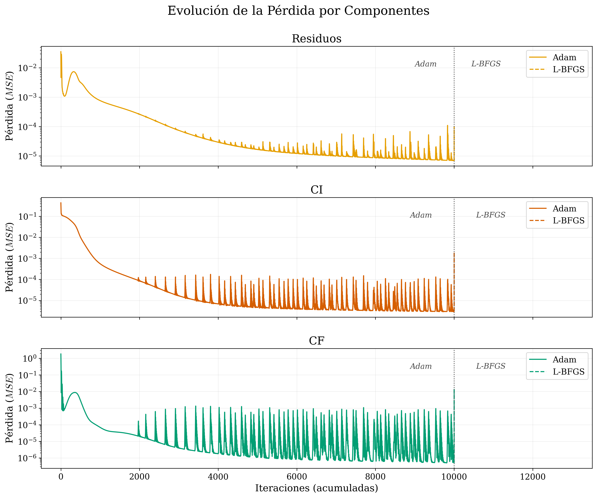
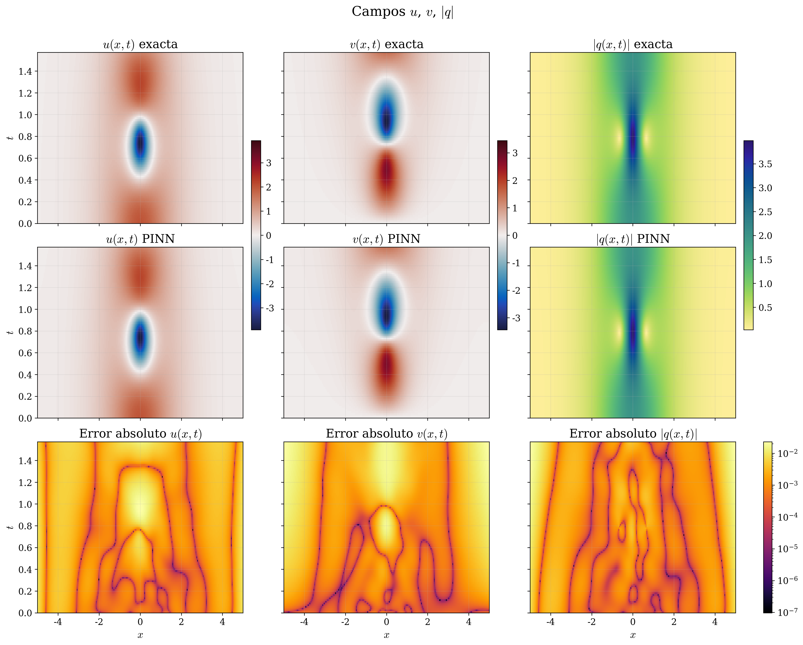

::: {.apartado-banner}
[Apartado 3]{.apartado-num}

## Calibración: ¿Es viable el método?

::: {.descripcion}
Arquitectura de referencia: [2, 3×40, 2]  
Decisión pragmática: tiempo de entrenamiento manejable, base de comparación clara.

**Pregunta a responder:** ¿puede la PINN capturar la dinámica no lineal y dispersiva de estructuras coherentes tipo solitón, relevantes en fluidos geofísicos?
:::
:::

---

## Sensibilidad a la arquitectura — NLS N=1 {.slide-titulo}

[$(N_0, N_b, N_f) = (50, 50, 10\,000)$ · Adam 10k + L-BFGS 10k]{.slide-subtitulo}

| Prof. ($L$) | Ancho ($W$) | $\mathcal{E}_{L_2}\ \|q\|$ | $\mathcal{E}_{L_2}\ u$ | $\mathcal{E}_{L_2}\ v$ | Iter. L-BFGS | Tiempo (min) |
|---|---|---|---|---|---|---|
| 2 | 10 | 4.94 × 10⁻³ | 4.39 × 10⁻³ | 1.25 × 10⁻² | 3474 | 4.36 |
| 2 | 40 | 4.41 × 10⁻³ | 3.46 × 10⁻³ | 1.32 × 10⁻² | 1925 | 3.79 |
| 2 | 80 | 4.62 × 10⁻³ | 3.47 × 10⁻³ | 1.36 × 10⁻² | 2969 | 4.27 |
| 3 | 10 | 4.19 × 10⁻³ | 3.08 × 10⁻³ | 1.34 × 10⁻² | 1927 | 4.59 |
| 3 | 40 | 5.80 × 10⁻³ | 4.62 × 10⁻³ | 1.39 × 10⁻² | [**13**]{.peor} | 3.71 |
| 3 | 80 | 4.53 × 10⁻³ | 3.19 × 10⁻³ | 1.39 × 10⁻² | 2167 | 4.74 |
| 8 | 10 | 4.36 × 10⁻³ | 3.05 × 10⁻³ | 1.36 × 10⁻² | 2098 | 8.42 |
| 8 | 40 | 4.12 × 10⁻³ | 2.77 × 10⁻³ | 1.32 × 10⁻² | 1723 | 8.12 |
| 8 | 80 | 4.27 × 10⁻³ | 2.85 × 10⁻³ | 1.35 × 10⁻² | 1234 | 8.03 |

::: {.caja-verde}
[Observación clave]{.etiqueta}
Los errores $\mathcal{E}_{L_2}$ son del mismo orden de magnitud en todas las configuraciones (~10⁻³). La selección se guió por tiempo de cómputo: **[2, 3×40, 2]** como arquitectura de referencia. La fila L=3, W=40 alcanzó solo 13 iteraciones de L-BFGS — posiblemente por variabilidad estocástica en Adam o en la inicialización.
:::

---

## Sensibilidad al régimen de datos — NLS N=1 {.slide-titulo}

[Red fija [2, 3×40, 2] · Adam 10k + L-BFGS 10k]{.slide-subtitulo}

| $N_0$ | $N_b$ | $N_f$ | $\mathcal{E}_{L_2}\ \|q\|$ | $\mathcal{E}_{L_2}\ u$ | $\mathcal{E}_{L_2}\ v$ | Iter. L-BFGS | Tiempo (min) |
|---|---|---|---|---|---|---|---|
| 50 | 50 | 5 000 | 5.84 × 10⁻³ | 4.61 × 10⁻³ | 1.39 × 10⁻² | [**14**]{.peor} | 3.64 |
| 50 | 50 | 10 000 | 5.80 × 10⁻³ | 4.62 × 10⁻³ | 1.39 × 10⁻² | [**13**]{.peor} | 3.71 |
| 50 | 50 | 20 000 | 4.51 × 10⁻³ | 3.25 × 10⁻³ | 1.32 × 10⁻² | 1595 | 4.32 |
| 100 | 100 | 5 000 | 4.57 × 10⁻³ | 3.42 × 10⁻³ | 1.31 × 10⁻² | 1053 | 4.08 |
| 100 | 100 | 10 000 | 5.93 × 10⁻³ | 4.90 × 10⁻³ | 1.39 × 10⁻² | [**16**]{.peor} | 3.57 |
| 100 | 100 | 20 000 | 5.94 × 10⁻³ | 4.87 × 10⁻³ | 1.40 × 10⁻² | [**12**]{.peor} | 4.62 |

::: {.caja-verde}
[Observación clave]{.etiqueta}
Los errores son del mismo orden de magnitud en todos los regímenes. Las iteraciones bajas de L-BFGS (12–16) indican que Adam entregó un punto inicial suficientemente bueno — L-BFGS solo necesitó un refinamiento mínimo. La configuración $(50, 50, 10\,000)$ es suficiente y eficiente en tiempo.
:::

---

## Convergencia del entrenamiento — NLS N=1 {.slide-titulo}

[Evolución de $\mathcal{L}$ por componente · [2, 3×40, 2] · $(N_0, N_b, N_f) = (50, 50, 10\,000)$]{.slide-subtitulo}

::::: {.dos-col}
:::: {}
{.lightbox fig-alt="Pérdida por componentes NLS N=1"}
::::

:::: {}
::: {.col-label}
Interpretación
:::

- La figura muestra la evolución de $\mathcal{L}$ por componente — es una métrica del proceso de optimización, no del error de aproximación de la PDE.
- Las oscilaciones en Adam son inherentes al método estocástico y no indican inestabilidad.
- La convergencia es hacia un mínimo local del paisaje de pérdida — no garantiza un error $L_2$ pequeño; por ello ambas métricas se reportan por separado.
- La transición Adam → L-BFGS muestra que el refinamiento cuasi-Newton parte de una región ya favorable, lo que explica las pocas iteraciones requeridas.
::::
:::::

---

## Evolución temporal — NLS N=1 {.slide-titulo}

[$|q|$ exacta vs. predicha · error absoluto · [2, 3×40, 2] · $(N_0, N_b, N_f) = (50, 50, 10\,000)$]{.slide-subtitulo}

::::: {.dos-col}
:::: {}
<video src="figures/movie_NLS_N1.mp4" controls></video>
::::

:::: {}
::: {.col-label}
Qué observar
:::

- La predicción sigue fielmente la solución exacta en la región central.
- El error se concentra en los bordes del dominio (la red sobreestima ahí) y se propaga al centro.
- Errores bajos (~10⁻⁷) reflejan la estructura de la solución — se asocian a regiones de gradientes suaves.
::::
:::::

---

## Estado ligado — NLS N=2 {.slide-titulo}

[Panel de campos: $u$, $v$, $|q|$ exactos y predichos · error absoluto]{.slide-subtitulo}

::::: {.dos-col}
:::: {}
{.lightbox fig-alt="Campos NLS N=2 Bound"}
::::

:::: {}
::: {.caja-verde}
[Configuración y métricas]{.etiqueta}
Arquitectura: [2, 3×40, 2]  
$(N_0, N_b, N_f)$: (50, 50, 10 000)  
Dominio: $x \in [-5,5]$, $t \in [0, \pi/2]$  
Seed: 1234 · Tiempo: 8.34 min  
Iter. L-BFGS: 10 000 (máximo alcanzado)

$\mathcal{E}_{L_2}\ |q|$: 4.66 × 10⁻³  
$\mathcal{E}_{L_2}\ u$: 5.47 × 10⁻³  
$\mathcal{E}_{L_2}\ v$: 1.16 × 10⁻²
:::

::: {.caja-hallazgo}
[Observaciones]{.etiqueta}
L-BFGS alcanzó el máximo de iteraciones — el problema N=2 es significativamente más difícil que N=1 (13 iter.).

Bandas de error bajo (~10⁻⁷) asociadas a gradientes suaves: **primera aparición visible de estrías**.
:::
::::
:::::

---

## Colisión no lineal — NLS N=2 {.slide-titulo}

[Evolución temporal $|q|$ exacta vs. predicha · error absoluto]{.slide-subtitulo}

::::: {.dos-col}
:::: {}
<video src="figures/L_solution_vs_error_N2Inter_100N0_100Nb_20kNf_4x80.mp4" controls></video>

::: {.caja-verde}
[El método es viable]{.etiqueta}
La PINN escala de estructuras simples (N=1) a interacciones complejas (N=2) manteniendo errores $L_2$ del orden 10⁻³–10⁻². Base metodológica establecida para extender a Hirota.
:::
::::

:::: {}
::: {.caja-verde}
[Configuración y métricas]{.etiqueta}
Arquitectura: [2, 4×80, 2]  
$(N_0, N_b, N_f)$: (100, 100, 20 000)  
Dominio: $x \in [0,20]$, $t \in [0,5]$  
Seed: 1234 · Tiempo: 16.9 min  
Iter. L-BFGS: 14 258 / 20 000

$\mathcal{E}_{L_2}\ |q|$: 8.21 × 10⁻³  
$\mathcal{E}_{L_2}\ u$: 1.26 × 10⁻²  
$\mathcal{E}_{L_2}\ v$: 1.47 × 10⁻²
:::

::: {.caja-hallazgo}
[Observaciones]{.etiqueta}
L-BFGS usó 14 258 de 20 000 iteraciones — la colisión es más exigente que el estado ligado. El error $L_2$ es consistentemente mayor, reflejando la dificultad de capturar la interacción no lineal.
:::
::::
:::::
