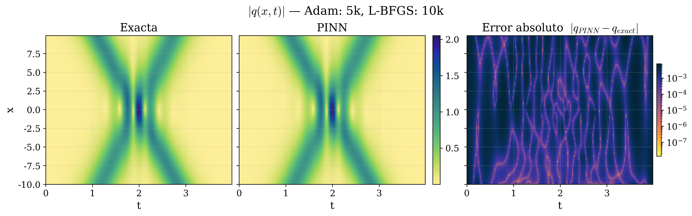
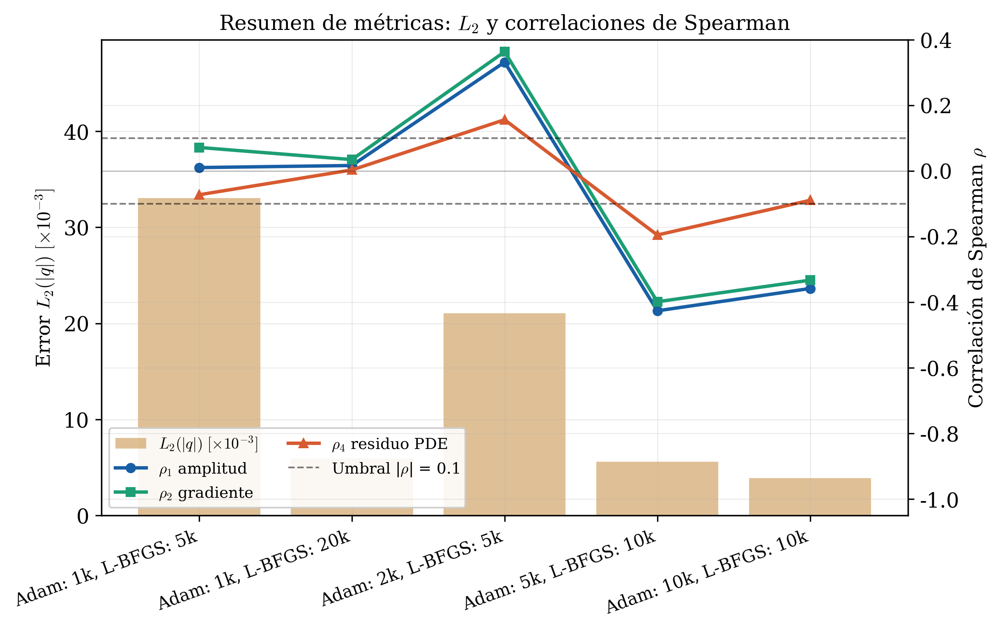
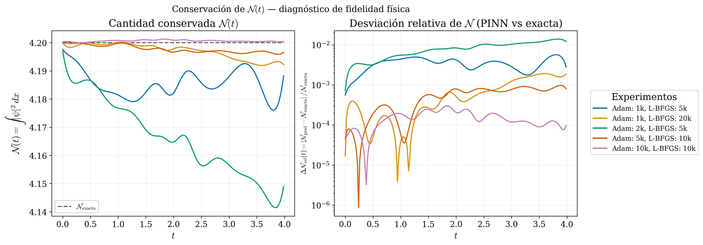

```{=html}
<div class="separador-apartado">
  <div class="apartado-num">Apartado 4</div>
  <h2>Exploración con Hirota</h2>
  <div class="descripcion">
    La calibración con NLS confirmó que el método funciona. Ahora lo extendemos
    a Hirota — una ecuación estructuralmente más compleja — y analizamos qué nos
    dice el patrón de error sobre la física que la red aprendió.<br><br>
    <strong style="color:#56CFE1;">Pregunta I:</strong> ¿Escala el método a una ecuación más compleja?<br>
    <strong style="color:#56CFE1;">Pregunta II:</strong> ¿Qué nos dice el error sobre la física aprendida?
  </div>
</div>
```

## Hirota N=1 — Reproducibilidad {#hirota-n1}

*Comparación con Zhou & Yan (2021) · Solitón brillante*

::: {.caja-verde}
<div class="etiqueta">Configuración</div>
Arquitectura: [2, 5×40, 2] · $(N_0, N_b, N_f)$: (50, 100, 10 000) · Dominio: $x \in [-10,10]$, $t \in [0,5]$  
Adam: 5k · L-BFGS: 10k (4 647 alcanzadas) · Seed: 1234 · lr = 0.001
:::

| Métrica | Este trabajo | Zhou & Yan (2021) |
|---------|:-----------:|:-----------------:|
| $N_0$ / $N_b$ / $N_f$ | 50 / 100 / 10 000 | 100 / 200 / 10 000 |
| Adam / L-BFGS | 5k / 10k | 10k / 10k |
| Seed | 1234 | No reportada |
| $\mathcal{E}_{L_2}\ \|q\|$ | **3.22 × 10⁻³** | 9.32 × 10⁻³ |
| $\mathcal{E}_{L_2}\ u$ | **1.86 × 10⁻²** | 5.33 × 10⁻² |
| $\mathcal{E}_{L_2}\ v$ | **1.33 × 10⁻²** | 3.85 × 10⁻² |
| Tiempo (min) | **8.23** | 11.95 |

::: {.caja-hallazgo}
<div class="etiqueta">Justificación de configuraciones base</div>
Se reproduce el resultado de Zhou & Yan con menos datos y menos épocas de Adam, mejorando en todas las métricas. Esto establece la configuración base para los experimentos de N=2.
:::

---

## Hirota N=2 Estado ligado — Exploración de configuraciones {#hir-n2-bound}

*$(N_0, N_b, N_f)$: (50, 50, 10 000) · Adam 5k · L-BFGS 10k · Seed: 1234 · lr = 5×10⁻⁴*

| Configuración | $\mathcal{E}_{L_2}\ \|q\|$ | $\mathcal{E}_{L_2}\ u$ | $\mathcal{E}_{L_2}\ v$ | Iter. L-BFGS | Tiempo (min) |
|:---:|:---:|:---:|:---:|:---:|:---:|
| $[3\times 40]$ | 6.59 × 10⁻² | 5.71 × 10⁻² | 1.51 × 10⁻¹ | 10 000 | 9.4 |
| $[4\times 80]$ | 6.57 × 10⁻² | 4.86 × 10⁻² | 1.36 × 10⁻¹ | 7 598 | 11.8 |
| $[5\times 80]$ | 6.53 × 10⁻² | 4.93 × 10⁻² | 1.37 × 10⁻¹ | 7 630 | 13.9 |

::: {.caja-hipotesis}
<div class="etiqueta">Observación</div>
Los errores son del mismo orden de magnitud en todas las configuraciones (~10⁻²–10⁻¹) — la arquitectura no explica la diferencia. Los errores son significativamente mayores que en NLS y Hirota N=1, lo que motiva una investigación más profunda en el Apartado 5 (Condiciones de Frontera).
:::

::: {.caja-hallazgo}
<div class="etiqueta">Dominio</div>
$x \in [-5, 5]$, $t \in [0, 2\pi]$
:::

---

## Hirota N=2 Colisión — Sensibilidad a épocas {#hir-n2-inter-epocas}

*Arquitectura: [2, 5×80, 2] · $(N_0, N_b, N_f)$: (50, 50, 10 000) · Seed: 1234 · lr = 0.001*

| Experimento | $\mathcal{E}_{L_2}\ \|q\|$ | $\mathcal{E}_{L_2}\ u$ | $\mathcal{E}_{L_2}\ v$ | Iter. L-BFGS | Tiempo (min) |
|:---|:---:|:---:|:---:|:---:|:---:|
| Adam 1k · L-BFGS 5k | 3.30 × 10⁻² | 5.17 × 10⁻² | 4.18 × 10⁻² | 5 000 | 6.9 |
| Adam 1k · L-BFGS 20k | 5.92 × 10⁻³ | 9.26 × 10⁻³ | 8.43 × 10⁻³ | 14 123 | 17.7 |
| Adam 2k · L-BFGS 5k | 2.11 × 10⁻² | 4.04 × 10⁻² | 3.31 × 10⁻² | 5 000 | 7.9 |
| **Adam 5k · L-BFGS 10k** | **5.60 × 10⁻³** | **8.21 × 10⁻³** | **6.90 × 10⁻³** | **10 000** | **16.8** |
| Adam 10k · L-BFGS 10k | 3.88 × 10⁻³ | 5.99 × 10⁻³ | 5.29 × 10⁻³ | 9 089 | 20.6 |

::: {.caja-verde}
<div class="etiqueta">Benchmark seleccionado: Adam 5k · L-BFGS 10k</div>
Error del mismo orden de magnitud que Adam 10k · L-BFGS 10k (~10⁻³), con 3.8 min menos de entrenamiento. Criterio de selección: balance entre precisión y costo computacional.
:::

::: {.caja-hipotesis}
<div class="etiqueta">Observación</div>
Adam 1k · L-BFGS 20k alcanza un error similar al benchmark: L-BFGS puede compensar un Adam corto si se le dan suficientes iteraciones. Esto sugiere que la fase de exploración de Adam no es el único factor determinante: el presupuesto de refinamiento también importa.
:::

---

## Hirota N=2 Colisión — Campos y evolución temporal {#hir-n2-inter-campos}

*$|q|$ exacta · predicha · error absoluto · Adam 5k · L-BFGS 10k · Seed: 1234 · lr = 0.001*

::: {.fig-texto}

::: {}
{.lightbox group="exploracion"}

```{=html}
<video controls style="width:100%; border-radius:8px; margin-top:0.8rem; box-shadow:0 4px 20px rgba(13,27,42,0.18);">
  <source src="figures/L_solution_vs_error_Hir_N2Int_5kAdam_10kFGS.mp4" type="video/mp4">
</video>
```
:::

::: {}
::: {.caja-hallazgo}
<div class="etiqueta">Qué observar</div>
El error se concentra en la zona de colisión y en los bordes. Las estrías son visibles con patrones más complejos que en NLS — análisis formal en la sección de Correlaciones de Spearman.
:::
:::

:::

---

## Estructura del error — Correlaciones de Spearman {#spearman-inter}

*Hirota N=2 Colisión · $n \sim 20\,000$ puntos · umbral práctico $|\rho| > 0.3$*

::: {.fig-texto}

{.lightbox group="exploracion"}

::: {}
| Experimento | $\rho_1$ | $\rho_2$ | $\rho_4$† |
|:---|:---:|:---:|:---:|
| Adam 1k · L-BFGS 5k | +0.010 | +0.071 | −0.073 |
| Adam 1k · L-BFGS 20k | +0.016 | +0.034 | +0.003 |
| Adam 2k · L-BFGS 5k | +0.331 | +0.363 | +0.156 |
| **Adam 5k · L-BFGS 10k** | **−0.427** | **−0.399** | **−0.196** |
| Adam 10k · L-BFGS 10k | −0.359 | −0.333 | −0.090 |

<small>† $\rho_4 < 0$ equivale a correlación positiva residuo–error (convención de código).</small>

::: {.caja-hipotesis}
<div class="etiqueta">ρ₁, ρ₂ — Señal y convergencia</div>
Experimentos convergidos: $\rho_1, \rho_2 < 0$ — error menor donde la amplitud es mayor. El cambio de signo es indicador indirecto de convergencia.
:::
:::

:::

::: {.caja-hallazgo}
<div class="etiqueta">ρ₄ — Diagnóstico interno</div>
El residuo PDE predice cualitativamente el error real sin solución analítica de referencia — implicación directa para geofísica. Magnitud moderada: la interpolación fuera de los puntos de colocación introduce error no capturado por el residuo.
:::

---

## Conservación de $\mathcal{N}(t)$ — diagnóstico de fidelidad física {#norma-inter}

$\mathcal{N}(t) = \int |\psi|^2\,dx$ · cantidad conservada de la familia NLS–Hirota

{.lightbox .fig-grande group="exploracion"}

::: {.dos-tarjetas}

::: {.caja-hipotesis}
<div class="etiqueta">¿Qué miden estas curvas?</div>
CV $= 1.11\times10^{-6}$: la solución de referencia es numéricamente estable. $\Delta\mathcal{N}_\text{rel}(t) = |\mathcal{N}_\text{pred} - \mathcal{N}_\text{exact}| / \mathcal{N}_\text{exact}$ mide la desviación de la predicción respecto a la cantidad conservada en cada instante.
:::

::: {.caja-hallazgo}
<div class="etiqueta">Resultado</div>
Benchmark: $\max(\Delta\mathcal{N}_\text{rel}) = 9.78\times10^{-4}$ — por debajo del umbral $10^{-2}$. La PINN conserva $\mathcal{N}(t)$ sin imposición explícita. $\mathcal{N}(t)$ existe en NLS y se preserva en Hirota como su generalización — la red aprende la estructura simétrica subyacente.
:::

:::
