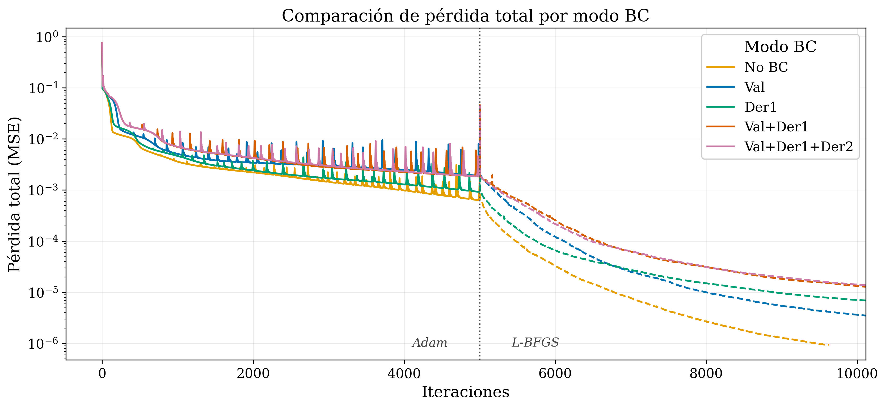
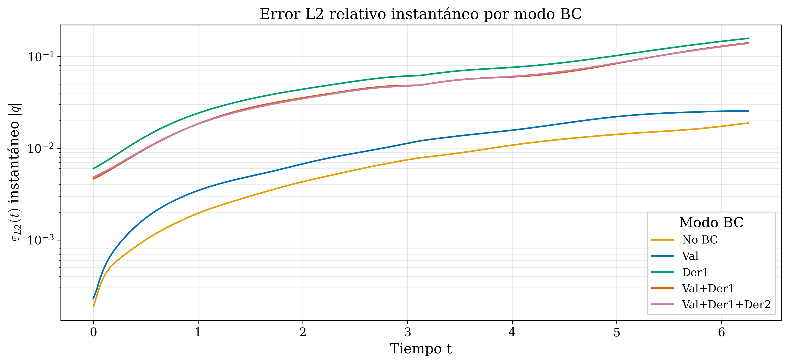
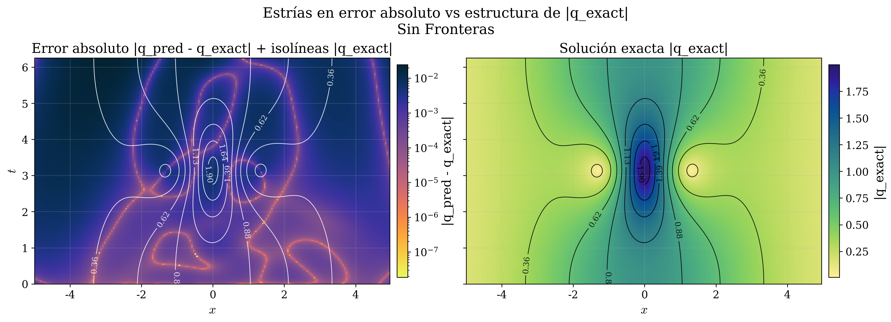

```{=html}
<div class="separador-apartado">
  <div class="apartado-num">Apartado 5</div>
  <h2>Condiciones de Frontera</h2>
  <div class="descripcion">
    Los experimentos de exploración mostraron errores del orden 10⁻² en Hirota N=2 Bound
    — significativamente mayores que en NLS. ¿Es la información de frontera la causa?<br><br>
    <strong style="color:#56CFE1;">Pregunta:</strong>
    ¿Cuánta información de frontera necesita la PINN para aprender correctamente?
  </div>
</div>
```

## Hirota N=1 — Estudio de condiciones de frontera {#bc-n1}

*5 modos BC × 3 dominios · $\mathcal{E}_{L_2}\ |q|$*

| Modo BC | Completo $[-10,10]$ | Recorte $[-5,5]$ | Recorte $[-2.5,2.5]$ |
|:--------|:-------------------:|:----------------:|:--------------------:|
| No BC | 3.32 × 10⁻³ | 1.55 × 10⁻² | 1.66 × 10⁻¹ |
| Val | 3.58 × 10⁻³ | 1.71 × 10⁻² | 1.66 × 10⁻¹ |
| Der1 | 3.44 × 10⁻³ | 2.20 × 10⁻² | **5.42 × 10⁻¹** |
| Val+Der1 | 3.22 × 10⁻³ | 1.53 × 10⁻² | **5.35 × 10⁻¹** |
| Val+Der1+Der2 | 3.17 × 10⁻³ | 1.47 × 10⁻² | **5.36 × 10⁻¹** |

::: {.dos-tarjetas}

::: {.caja-hipotesis}
<div class="etiqueta">Dominio completo</div>
Sin diferencia significativa entre modos — la dinámica está localizada en el centro del dominio. En los bordes no hay física que aprender.
:::

::: {.caja-hallazgo}
<div class="etiqueta">Recorte $[-2.5, 2.5]$</div>
Imponer derivadas colapsa la predicción (error ~10⁻¹). No BC y Val son los únicos modos robustos — la red penaliza restricciones inconsistentes con los datos.
:::

:::

---

## Hirota N=2 Colisión — Estudio de condiciones de frontera {#bc-inter}

*5 modos BC × 2 dominios · $\mathcal{E}_{L_2}\ |q|$*

| Modo BC | Completo $[-10,10]$ | Recorte $[-6,6]$ |
|:--------|:-------------------:|:----------------:|
| No BC | 1.40 × 10⁻² | 4.34 × 10⁻² |
| Val | 9.32 × 10⁻³ | 5.63 × 10⁻² |
| Der1 | 8.61 × 10⁻³ | **1.60 × 10⁻¹** |
| Val+Der1 | **5.60 × 10⁻³** | **9.89 × 10⁻²** |
| Val+Der1+Der2 | 6.27 × 10⁻³ | **9.89 × 10⁻²** |

::: {.dos-tarjetas}

::: {.caja-hipotesis}
<div class="etiqueta">Dominio completo</div>
Val+Der1 da el mejor resultado — aquí sí hay una mejora moderada con BC. La colisión ocurre lejos de los bordes y la red puede usar la información de frontera sin conflicto.
:::

::: {.caja-hallazgo}
<div class="etiqueta">Recorte $[-6,6]$</div>
La colisión queda cerca de los bordes — imponer derivadas colapsa la predicción (10⁻¹). No BC es el modo más robusto. Confirma el patrón de N=1: las derivadas son contraproducentes cuando la física aparece en los bordes.
:::

:::

---

## Alcance del estudio de condiciones de frontera {#bc-alcance}

*5 modos BC × 3 casos × dominios completos y recortados*

| Caso | Dominio | Mejor $\mathcal{E}_{L_2}\ \|q\|$ | Peor | Modo óptimo | Observación |
|:-----|:--------|:---:|:---:|:---:|:------------|
| Hirota N=1 | Completo $[-10,10]$ | 3.17 × 10⁻³ | 3.58 × 10⁻³ | Val+Der1+Der2 | Sin diferencia significativa |
| Hirota N=1 | Recorte $[-5,5]$ | 1.47 × 10⁻² | 2.20 × 10⁻² | Val+Der1+Der2 | Error sube — menos física en datos |
| Hirota N=1 | Recorte $[-2.5,2.5]$ | 1.66 × 10⁻¹ | 5.42 × 10⁻¹ | No BC / Val | Colapso con derivadas impuestas |
| Hirota N=2 Inter | Completo $[-10,10]$ | 5.60 × 10⁻³ | 1.40 × 10⁻² | Val+Der1 | BC mejora moderadamente |
| Hirota N=2 Inter | Recorte $[-6,6]$ | 4.34 × 10⁻² | 1.60 × 10⁻¹ | No BC | Derivadas colapsan — sin física en bordes |

::: {.dos-tarjetas}

::: {.caja-hipotesis}
<div class="etiqueta">Patrón general</div>
En dominio completo, el modo BC tiene poco efecto — la dinámica está localizada lejos de los bordes. Al recortar, la física del solitón aparece en los bordes y las derivadas impuestas colapsan la predicción.
:::

::: {.caja-hallazgo}
<div class="etiqueta">Foco del análisis detallado</div>
El caso Bound concentra el hallazgo central — se presenta en detalle a continuación. N=1 e Inter se incluyen como contexto comparativo.
:::

:::

---

## Hirota N=2 Bound — Hallazgo central {#bc-bound-hallazgo}

*Dominio completo $x\in[-5,5]$, $t\in[0,2\pi]$ · $(N_0,N_b,N_f)$: (50,50,10 000) · Adam 5k · L-BFGS 10k*

::: {.dos-tarjetas}

::: {}
**Arquitectura [4×80]**

| Modo BC | $\mathcal{E}_{L_2}\ \|q\|$ | Tiempo (min) |
|:--------|:---:|:---:|
| **No BC** | **9.91 × 10⁻³** | 7.9 |
| Val | 1.50 × 10⁻² | 9.5 |
| Der1 | 7.84 × 10⁻² | 10.5 |
| Val+Der1 | 6.57 × 10⁻² | 11.8 |
| Val+Der1+Der2 | 6.55 × 10⁻² | 12.5 |
:::

::: {}
**Arquitectura [5×80]**

| Modo BC | $\mathcal{E}_{L_2}\ \|q\|$ | Tiempo (min) |
|:--------|:---:|:---:|
| **No BC** | **1.14 × 10⁻²** | 10.0 |
| Val | 1.55 × 10⁻² | 12.4 |
| Der1 | 6.86 × 10⁻² | 13.5 |
| Val+Der1 | 6.53 × 10⁻² | 14.7 |
| Val+Der1+Der2 | 6.55 × 10⁻² | 15.9 |
:::

:::

::: {.dos-tarjetas}

::: {.caja-hallazgo}
<div class="etiqueta">Hallazgo central</div>
Sin BC es el mejor modo en ambas arquitecturas. Imponer derivadas aumenta el error un orden de magnitud (~10⁻²→10⁻¹). La red penaliza restricciones físicamente inconsistentes con los datos — en los bordes no hay dinámica del bound state.
:::

::: {.caja-hipotesis}
<div class="etiqueta">4×80 vs 5×80</div>
4×80 supera a 5×80 en todas las configuraciones con menor tiempo de entrenamiento. Una red más densa no mejora — posible sobreajuste a los datos disponibles. 4×80 es la configuración óptima para este conjunto de datos.
:::

:::

---

## Convergencia y error instantáneo por modo BC {#bc-convergencia}

::: {.dos-figuras}

{.lightbox group="fronteras"}

{.lightbox group="fronteras"}

:::

::: {.dos-tarjetas}

::: {.caja-hipotesis}
<div class="etiqueta">Convergencia</div>
No BC converge primero y más profundo en Adam. En L-BFGS, todos los modos con derivadas convergen más lento — la red dedica capacidad a minimizar restricciones inconsistentes con los datos.
:::

::: {.caja-hallazgo}
<div class="etiqueta">Error instantáneo</div>
Der1, Val+Der1 y Val+Der1+Der2 acumulan error en el tiempo — alcanzan 10⁻¹ al final del dominio. No BC y Val se mantienen en 10⁻². El error crece porque la física impuesta en los bordes no está presente en los datos.
:::

:::

---

## Residuo PDE por modo BC {#bc-residuo}

*$F_\text{mag} = \sqrt{F_u^2 + F_v^2}$ — incumplimiento local de la ecuación de Hirota*

{.lightbox .fig-grande group="fronteras"}

::: {.caja-hallazgo}
<div class="etiqueta">Interpretación</div>
No BC muestra el residuo más uniformemente distribuido — la red respeta la física en todo el dominio. Los modos con derivadas concentran residuo alto en regiones específicas, especialmente Val+Der1+Der2: la penalización en los bordes distorsiona el aprendizaje de la física interior. **No es suficiente con no imponer fronteras — la física debe estar presente en los datos.**
:::

---

## Estructura del error · Sin fronteras {#bc-estrias}

*Error absoluto + isolíneas $|q_\text{exact}|$ · No BC · [4×80]*

{.lightbox .fig-grande group="fronteras"}

::: {.dos-tarjetas}

::: {.caja-hipotesis}
<div class="etiqueta">Estrías de error bajo</div>
Las bandas de error bajo (~10⁻⁷) coinciden con las isolíneas de baja amplitud — regiones de gradientes suaves donde la solución varía lentamente. Confirma el patrón observado en NLS y Hirota N=2 Colisión.
:::

::: {.caja-hallazgo}
<div class="etiqueta">Error alto</div>
El error máximo (~10⁻²) aparece en las regiones de mayor amplitud y gradiente del bound state — donde la dinámica es más compleja. Consistente con $\rho_1 < 0$ reportado para experimentos convergidos.
:::

:::

---

## Conservación de $\mathcal{N}(t)$ y flujo de frontera {#bc-norma}

*CV$({\mathcal{N}_\text{exact}}) = 1.95\times10^{-4}$ · $\max(\Delta\mathcal{N}_\text{rel})$ entre $4\times10^{-3}$ y $7\times10^{-3}$*

{.lightbox .fig-grande group="fronteras"}

::: {.dos-tarjetas}

::: {.caja-hipotesis}
<div class="etiqueta">Fuga de norma estructurada</div>
$\mathcal{N}_\text{exact}$ no es constante — el dominio $[-5,5]$ trunca las colas del bound state y la norma "escapa" por los bordes. El flujo de frontera oscila armónicamente con la frecuencia interna del estado ligado — es física del sistema, no artefacto numérico.
:::

::: {.caja-hallazgo}
<div class="etiqueta">La PINN aprende la dinámica presente</div>
La red sigue fielmente la evolución de $\mathcal{N}_\text{exact}$, incluyendo la fuga estructurada. El patrón armónico del flujo es capturado sin imposición explícita — la conservación inherente se extiende a la dinámica de frontera presente en los datos.
:::

:::
