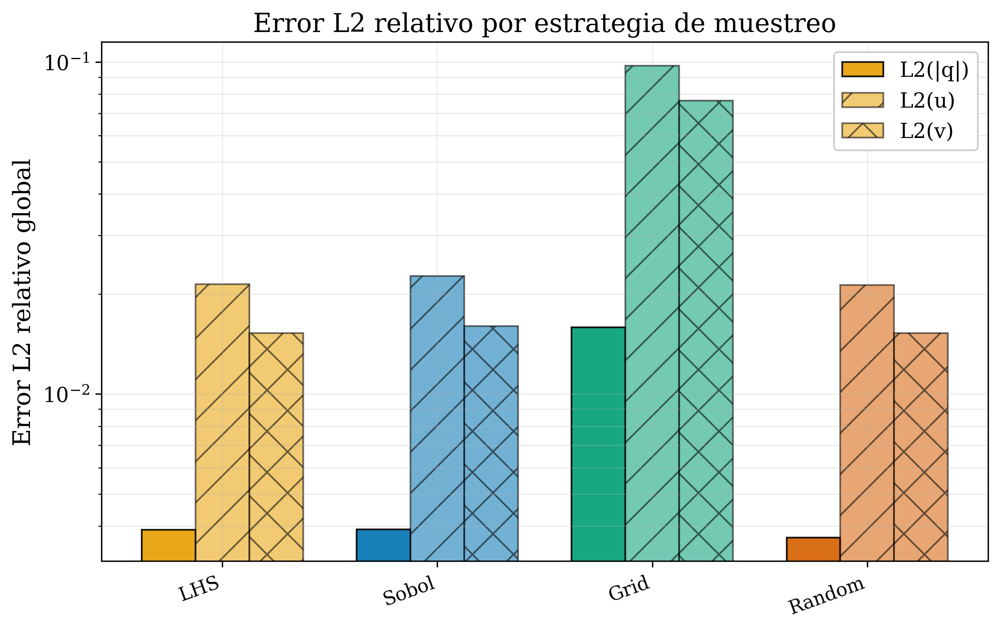
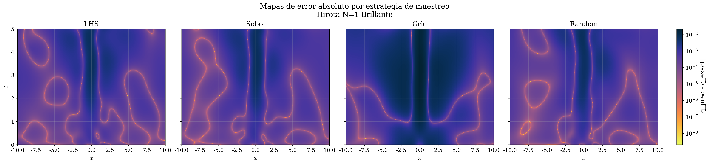
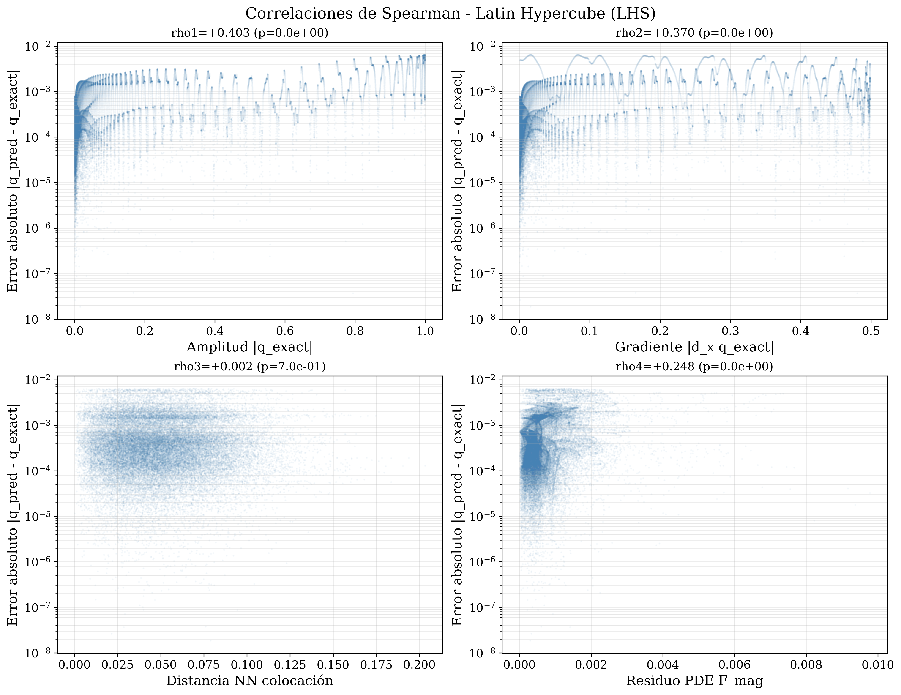
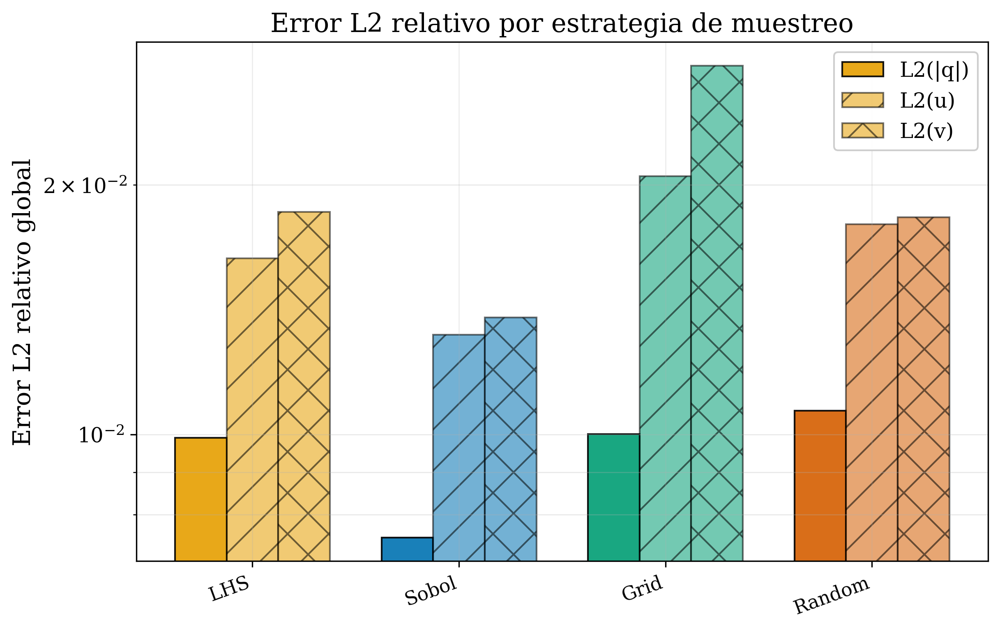
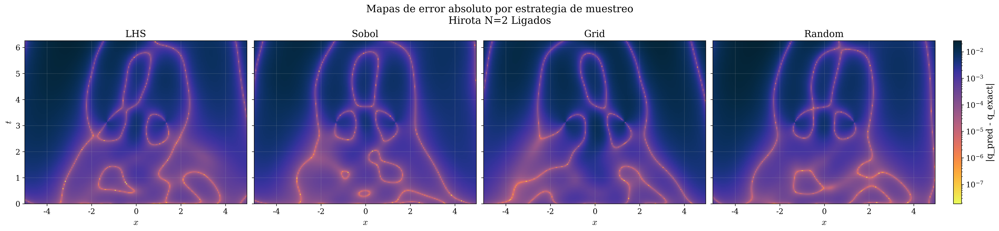
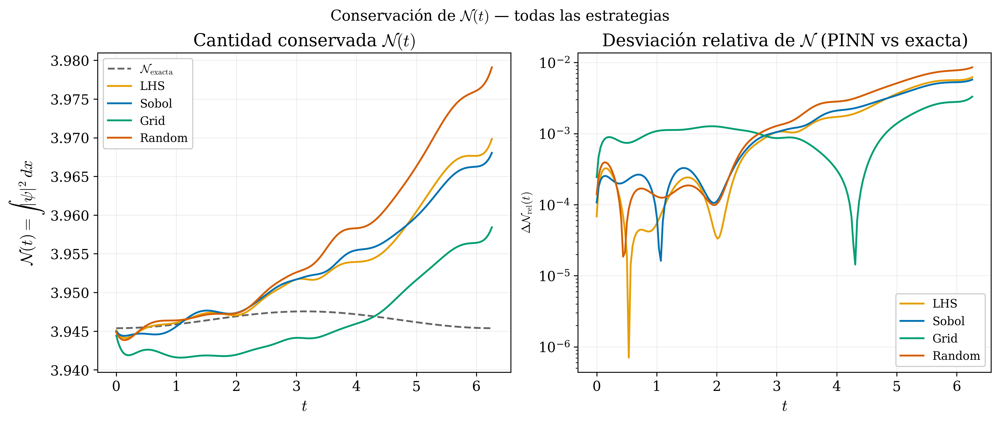

::: {.apartado-banner}
[Apartado 6]{.apartado-num}

## Estrategias de Muestreo

::: {.descripcion}
Dado que el hallazgo de BC reduce los requisitos de información a priori, la pregunta natural es: ¿importa cómo distribuimos los puntos de colocación?

**Pregunta:** ¿Afecta la estrategia de muestreo el desempeño de la PINN y la estructura del error?
:::
:::

---

## Fundamentos y distribución de puntos {.slide-titulo}

[Hirota N=1 · $N_f = 10\,000$ puntos de colocación · dominio $x\in[-10,10]$, $t\in[0,5]$]{.slide-subtitulo}

::::: {.dos-col}
:::: {}
{.lightbox fig-alt="Panel de distribución de puntos de muestreo Hirota N=1"}
::::

:::: {}
::: {.caja-hipotesis}
[Discrepancia y cobertura]{.etiqueta}
Mide qué tan uniformemente se distribuyen los puntos. LHS y Sobol tienen discrepancia baja por construcción — garantizan cobertura uniforme en cada dimensión. Random tiene discrepancia alta. Grid es determinista pero rígido.
:::

::: {.caja-hipotesis}
[Grid — aspect ratio y puntos efectivos]{.etiqueta}
Para dominio $L_x \times L_t$, el número óptimo de puntos por dimensión es $N_x = \sqrt{N_f \cdot L_x/L_t}$, $N_t = \sqrt{N_f \cdot L_t/L_x}$. Para este caso: $N_x = 141$, $N_t = 71$ ($\approx 10\,000$). Se añaden puntos extra en IC y BC. Un aspect ratio desfavorable sesga el aprendizaje hacia una dimensión.
:::

::: {.caja-hallazgo}
[Sobol — potencia de 2]{.etiqueta}
Secuencia cuasi-aleatoria de baja discrepancia. Rendimiento óptimo con $2^k$ puntos ($2^{13}=8\,192$). Se usa $N_f=10\,000$ para comparación justa — el rendimiento real de Sobol sería ligeramente mejor con $8\,192$.
:::
::::
:::::

---

## Comparación de desempeño por estrategia — Hirota N=1 {.slide-titulo}

[Arquitectura [2, 5×40, 2] · Adam 10k · L-BFGS 10k · Seed: 1234]{.slide-subtitulo}

::::: {.dos-col}
:::: {}
{.lightbox fig-alt="Barras L2 por estrategia Hirota N=1"}
::::

:::: {}
| Estrategia | $\mathcal{E}_{L_2}\ \|q\|$ | $\mathcal{E}_{L_2}\ u$ | $\mathcal{E}_{L_2}\ v$ | Tiempo (min) |
|---|---|---|---|---|
| **LHS** | **3.90 × 10⁻³** | 2.14 × 10⁻² | 1.53 × 10⁻² | 10.8 |
| **Sobol** | **3.91 × 10⁻³** | 2.26 × 10⁻² | 1.60 × 10⁻² | 11.0 |
| Random | 3.69 × 10⁻³ | 2.13 × 10⁻² | 1.52 × 10⁻² | 11.1 |
| [Grid]{.peor} | [1.59 × 10⁻²]{.peor} | [9.75 × 10⁻²]{.peor} | [7.64 × 10⁻²]{.peor} | 10.4 |

::: {.caja-hallazgo}
[Resultado]{.etiqueta}
LHS, Sobol y Random son equivalentes en $|q|$ (~$3.7\times10^{-3}$). Grid falla en $u$ y $v$ (~$10^{-1}$) por el aspect ratio desfavorable — las componentes son más sensibles a la distribución espacial que la amplitud.
:::
::::
:::::

---

## Estrías y correlaciones — el muestreo no explica el patrón de error {.slide-titulo}

[$\rho_3 \approx 0$ en todas las estrategias · $n \sim 20\,000$ puntos]{.slide-subtitulo}

::::: {.dos-col}
:::: {}
{.lightbox fig-alt="Comparación de estrías por estrategia Hirota N=1"}

{.lightbox fig-alt="Scatter Spearman LHS Hirota N=1"}
::::

:::: {}
| Estrategia | $\rho_1$ | $\rho_2$ | $\rho_3$ | $\rho_4$ |
|---|---|---|---|---|
| LHS | +0.403 | +0.370 | [**+0.002**]{.mejor} | +0.248 |
| Sobol | +0.477 | +0.441 | [**+0.001**]{.mejor} | +0.302 |
| Grid | +0.731 | +0.700 | −0.032 | +0.462 |
| Random | +0.431 | +0.397 | [**+0.013**]{.mejor} | +0.350 |

::: {.caja-hipotesis}
[$\rho_3 \approx 0$ — muestreo no explica las estrías]{.etiqueta}
La distancia al punto de colocación más cercano no correlaciona con el error en ninguna estrategia. Las estrías son estructura intrínseca de la solución — no artefacto del muestreo.
:::

::: {.caja-hallazgo}
[Grid — $\rho_1$, $\rho_2$ altos]{.etiqueta}
Grid muestra correlaciones más altas (~0.73) — el error está más sistemáticamente asociado a la estructura de la solución, posiblemente porque la rigidez de la grilla impide que la red compense errores locales.
:::
::::
:::::

---

## Muestreo — Hirota N=2 Bound sin BC {.slide-titulo}

[Arquitectura [2, 4×80, 2] · Adam 5k · L-BFGS 10k · Seed: 1234 · dominio $x\in[-5,5]$, $t\in[0,2\pi]$]{.slide-subtitulo}

::::: {.dos-col}
:::: {}
{.lightbox fig-alt="Panel de muestreo Hirota N=2 Bound"}

{.lightbox fig-alt="Barras L2 estrategias Hirota N=2 Bound"}
::::

:::: {}
| Estrategia | $\mathcal{E}_{L_2}\ \|q\|$ | $\mathcal{E}_{L_2}\ u$ | $\mathcal{E}_{L_2}\ v$ | Tiempo (min) |
|---|---|---|---|---|
| LHS | 9.91 × 10⁻³ | 1.63 × 10⁻² | 1.86 × 10⁻² | 7.9 |
| **Sobol** | [**7.51 × 10⁻³**]{.mejor} | **1.32 × 10⁻²** | **1.38 × 10⁻²** | 8.5 |
| Grid | 1.00 × 10⁻² | 2.05 × 10⁻² | 2.79 × 10⁻² | 8.0 |
| Random | 1.07 × 10⁻² | 1.79 × 10⁻² | 1.83 × 10⁻² | 8.3 |

::: {.caja-hipotesis}
[Grid no colapsa aquí]{.etiqueta}
El dominio $[-5,5]\times[0,2\pi]$ tiene aspect ratio más favorable que N=1 — Grid genera una grilla más equilibrada y no penaliza las componentes $u$ y $v$ como en N=1.
:::

::: {.caja-hallazgo}
[Sobol supera a LHS]{.etiqueta}
A diferencia de N=1, Sobol gana claramente en todas las métricas. Posible explicación: la dinámica del bound state tiene estructura más periódica — las secuencias cuasi-aleatorias de baja discrepancia la capturan mejor.
:::
::::
:::::

---

## Bound sin BC — Estrías, Spearman y conservación de $\mathcal{N}(t)$ {.slide-titulo}

::::: {.dos-col}
:::: {}
{.lightbox fig-alt="Estrías Hirota N=2 Bound por estrategia"}

{.lightbox fig-alt="Conservación norma Bound por estrategia"}
::::

:::: {}
| Estrategia | $\rho_1$ | $\rho_2$ | $\rho_3$ | $\rho_4$† |
|---|---|---|---|---|
| LHS | −0.282 | −0.174 | [**−0.007**]{.mejor} | −0.202 |
| Sobol | −0.327 | −0.208 | [**−0.002**]{.mejor} | −0.203 |
| Grid | −0.158 | −0.073 | −0.021 | −0.117 |
| Random | −0.284 | −0.185 | [**−0.001**]{.mejor} | −0.178 |

† Signo invertido por convención — $\rho_4 < 0$ equivale a correlación positiva residuo–error.

::: {.caja-hipotesis}
[$\rho_1$, $\rho_2$ negativos — experimentos convergidos]{.etiqueta}
Todas las estrategias muestran $\rho_1, \rho_2 < 0$ — consistente con el patrón de experimentos convergidos. El cambio de signo respecto a N=1 (donde eran positivos) refleja que aquí la red aprendió mejor la estructura de amplitud.
:::

::: {.caja-hallazgo}
[$\rho_3 \approx 0$ y conservación]{.etiqueta}
El muestreo no explica las estrías en ninguna estrategia. La conservación de $\mathcal{N}(t)$ sigue la fuga estructurada del dominio truncado — independiente de la estrategia de muestreo.
:::
::::
:::::
